Recruit Restaurant Visitor Forecasting

# Summary:

In this competition Kagglers are challenged to predict the future numbers of restaurant visitors. I think clear understanding of the given data is really important. That’s why I will explain the data  down to the finest detail. Then we will explore the winner’s solution.  

# Let's get familiar with the data :

* The data was collected from Japanese restaurants. 

* The data comes in the shape of 8 relational files which are derived from two separate Japanese websites that collect user information: Hot Pepper Gourmet (hpg)(search and reserve) and AirREGI(air)(reservation control and cash register).

    * Kagglers  must use the reservations, visits, and other information from these sites to forecast future restaurant visitor totals on a given date.

* The training data is based on the time range of Jan 2016 - most of Apr 2017, while the test set includes the last week of Apr plus May 2017. 

* The test set is split based on time and covers a chosen subset of the air restaurants.

* The test data "intentionally spans a holiday week in Japan called the ‘Golden Week.’ 

* The training set omits days where the restaurants were closed.

## File Descriptions :

* Each file is prefaced with the source (either air_ or hpg_) to indicate its origin. 

* Each restaurant has a unique air_store_id and hpg_store_id.

* Note that not all restaurants are covered by both systems, and that Kagglers have been provided data beyond the restaurants for which you must forecast. 

* Latitudes and Longitudes are not exact to discourage de-identification of restaurants.

* We have 8 files and these are  :

* **air_visit_data.csv**

* **air_reserve.csv** 

* **hpg_reserve.csv**

* **air_store_info.csv** 

* **hpg_store_info.csv**

* **store_id_relation.csv**

* **date_info.csv**

* **sample_submission.csv**: 

### [air_reserve.csv :](https://www.kaggle.com/headsortails/be-my-guest-recruit-restaurant-eda#air-reserve)

This file contains reservations made in the air system.

* air_store_id - the restaurant's id in the air system

* visit_datetime - the time of the reservation

* reserve_datetime - the time the reservation was made

* reserve_visitors - the number of visitors for that reservation

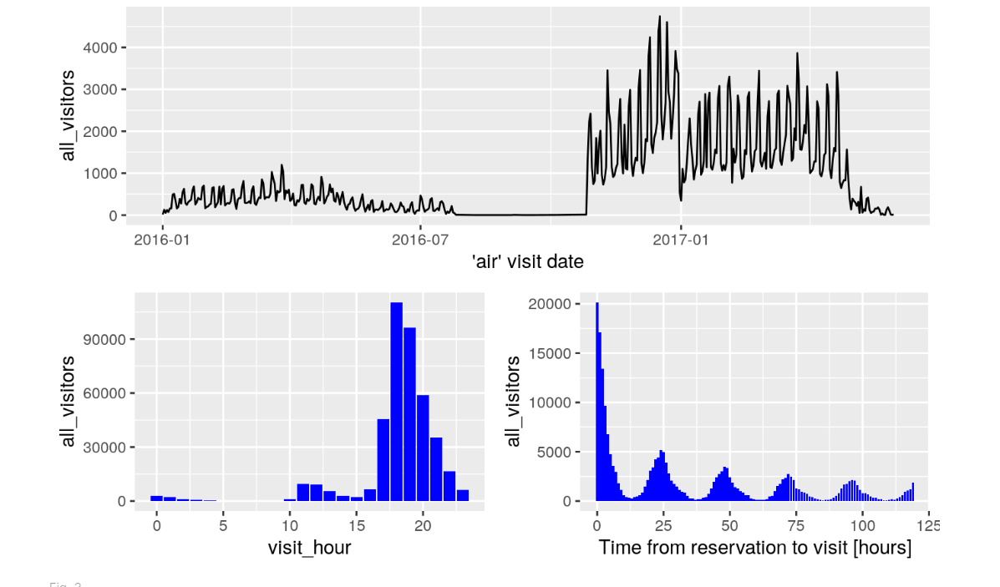

#### Take-away:

* There were much fewer reservations made in 2016 through the *air* system. The volume only increased during the end of that year. In 2017 the visitor numbers stayed strong. The artificial decline we see after the first quarter is most likely related to these reservations being at the end of the *training* time frame, which means that long-term reservations would not be part of this data set.

* Reservations are made typically for the dinner *hours* in the evening.

### [hpg_reserve.csv](https://www.kaggle.com/headsortails/be-my-guest-recruit-restaurant-eda#hpg-reserve)

This file contains reservations made in the hpg system.

* hpg_store_id - the restaurant's id in the hpg system

* visit_datetime - the time of the reservation

* reserve_datetime - the time the reservation was made

* reserve_visitors - the number of visitors for that reservation.

* 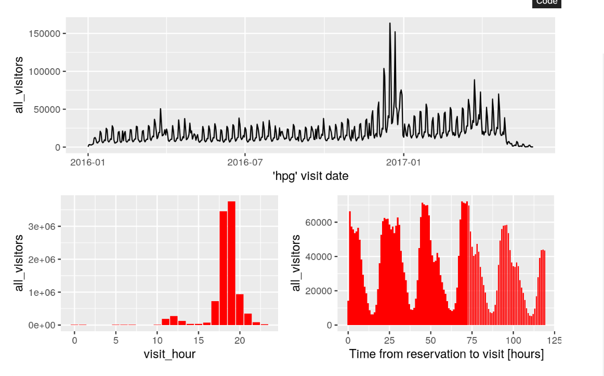

#### Take-away:

* Here the visits after reservation follow a more orderly pattern, with a clear spike in Dec 2016. We also see reservation visits dropping off as we get closer to the end of the time frame.

* Again, most reservations are for dinner, and we see another nice 24-hour pattern for making these reservations. It’s worth noting that here the last few hours before the visit don’t see more volume than the 24 or 48 hours before.

### [air_store_info.csv](https://www.kaggle.com/headsortails/be-my-guest-recruit-restaurant-eda#air-store)

This file contains information about select air restaurants. 

* air_store_id

* air_genre_name

* air_area_name

* latitude

* longitude

	*Note: latitude and longitude are the latitude and longitude of the *area* to which the store belongs

### [hpg_store_info.csv](https://www.kaggle.com/headsortails/be-my-guest-recruit-restaurant-eda#hpg-store)

This file contains information about select hpg restaurants.

* hpg_store_id

* hpg_genre_name

* hpg_area_name

* latitude

* longitude

*Note: latitude and longitude are the latitude and longitude of the *area* to which the store belongs

### [store_id_relation.csv](https://www.kaggle.com/headsortails/be-my-guest-recruit-restaurant-eda#store-ids)

This file allows you to join select restaurants that have both the air and hpg system.

* hpg_store_id

* air_store_id

### [air_visit_data.csv](https://www.kaggle.com/headsortails/be-my-guest-recruit-restaurant-eda#air-visits)

This file contains historical visit data for the air restaurants.

* air_store_id

* visit_date - the date

* visitors - the number of visitors to the restaurant on the date

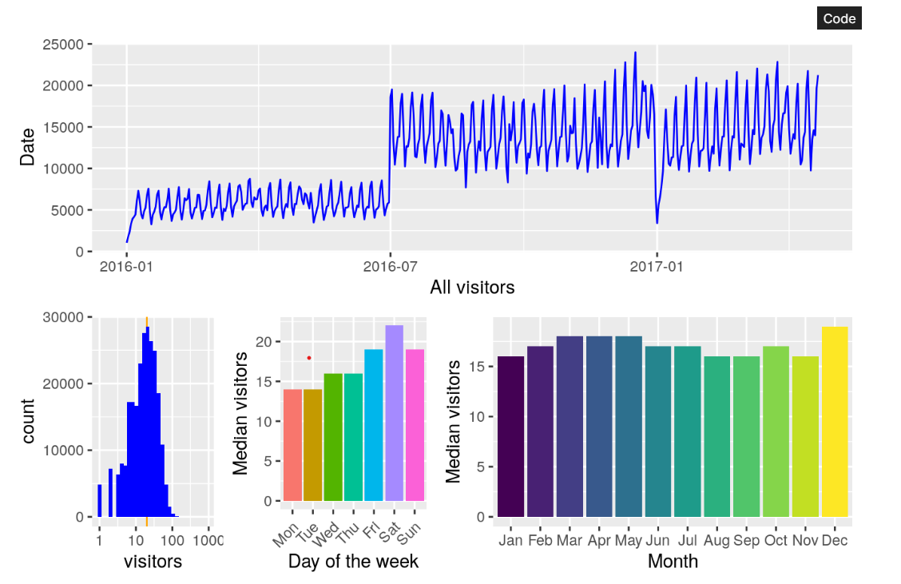

#### Take-away :

* There is an interesting long-term step structure in the overall time series. This might be related to new restaurants being added to the database. In addition, we already see a periodic pattern that most likely corresponds to a weekly cycle.

* The number of guests per visit per restaurant per day peaks at around 20 (the orange line in the second graph). The distribution extends up to 100.

* Friday and the weekend appear to be the most popular days. 

* Monday and Tuesday have the lowest numbers of average visitors.

* Also during the year there is a certain amount of variation. Dec appears to be the most popular month for restaurant visits. 

### sample_submission.csv

This file shows a submission in the correct format, including the days for which you must forecast.

* id - the id is formed by concatenating the air_store_id and visit_date with an underscore

* visitors- the number of visitors forecasted for the store and date combination

### date_info.csv

This file gives basic information about the calendar dates in the dataset.

* calendar_date

* day_of_week

* holiday_flg - is the day a holiday in Japan

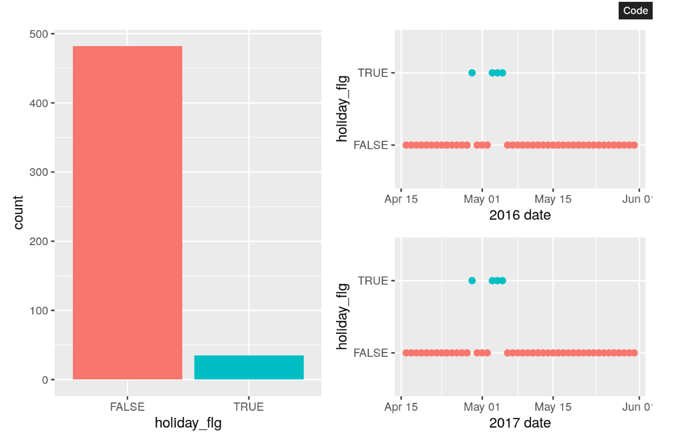

#### Take-away:

* There are about 7% holidays in our dataThe test and training data: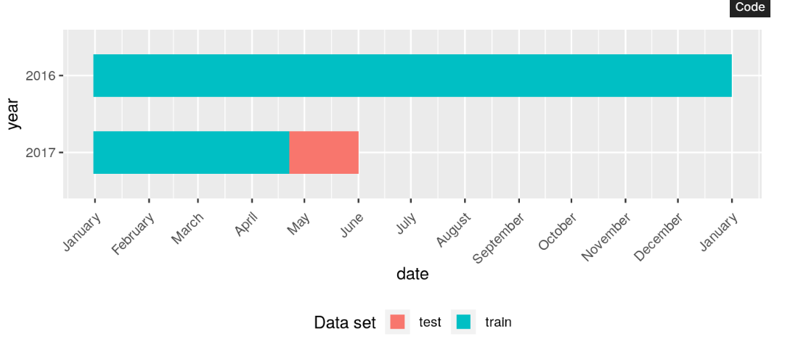 

the time range of the *train* vs *test* data sets.

### Stores:

The AirREGI data has 829 stores and the Hot Pepper Gourmet data has 4690 stores.

Numbers of different types of cuisine:

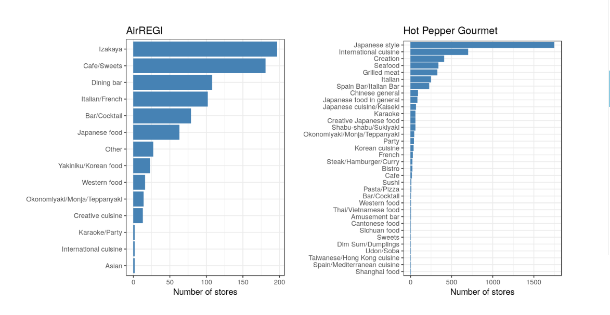

The areas with the most restaurants:

# 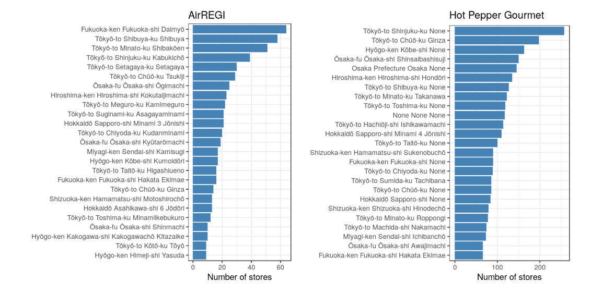  

# 5 Feature relations :

After looking at every data set individually, let’s get to the real fun and start combining them. This will tell us something about the relations between the various features and how these relations might affect the visitor numbers. 

## Visitors per genre:

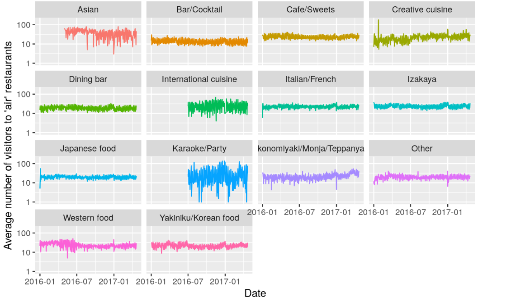

Take-away:

* The mean values range between 10 and 100 visitors per genre per day. Within each category, the long-term trend looks reasonably stable.

## The impact of holidays:

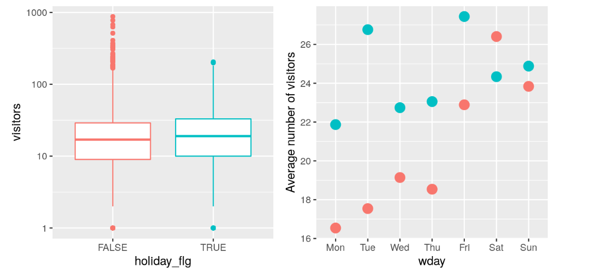

#### Take-away:

* Overall, holidays don’t have any impact on the average visitor numbers (left panel).

* While a weekend holiday has little impact on the visitor numbers, and even decreases them slightly, there is a much more pronounced effect for the weekdays; especially Monday and Tuesday (right panel).

## Restaurants per area and the effect on visitor numbers: 

Our next exploration follows from a simple thought:

 if gastropubs are popular and we own the only gastropub in the area then we can expect lots of customers. If there are twelve other gastropubs in our street then, try as we might, some of those customers will venture into other establishments. Therefore, let’s study the number of restaurants of a certain *genre* per *area* and their impact on visitor numbers.

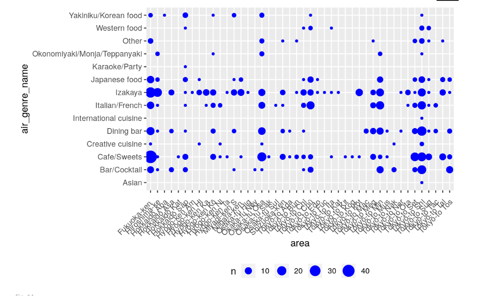

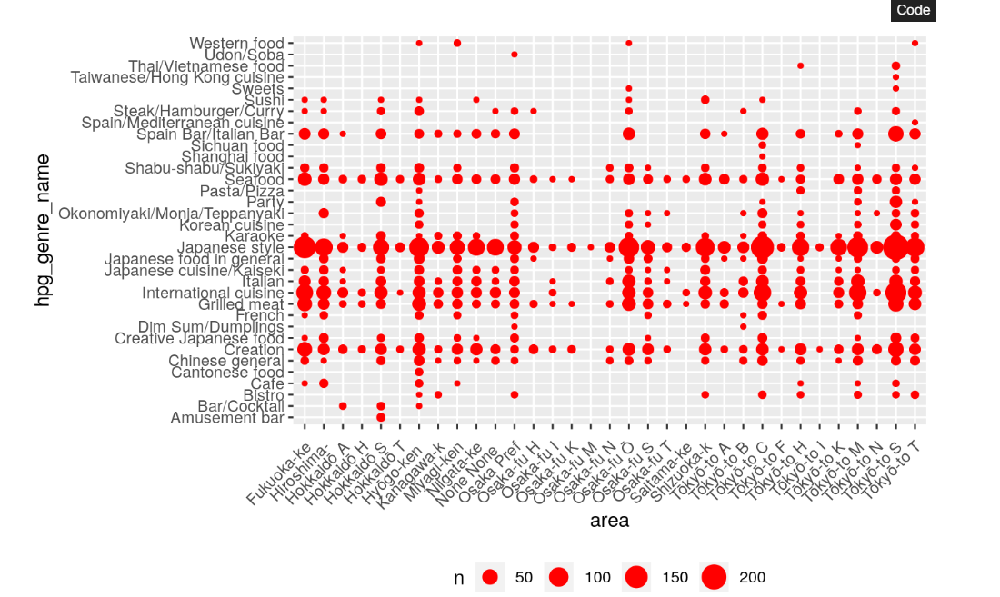

These plots will helps us to understand relationship between the number of visitors and the number of restaurants by genre per area in the context of previously described thought. 

## Reservations vs Visits:

Now we will plot the total *reserve_visitor* numbers against the actual *visitor* numbers for the *air* restaurants. The grey line shows reserve_visitors == visitors and the blue line is a linear fit:

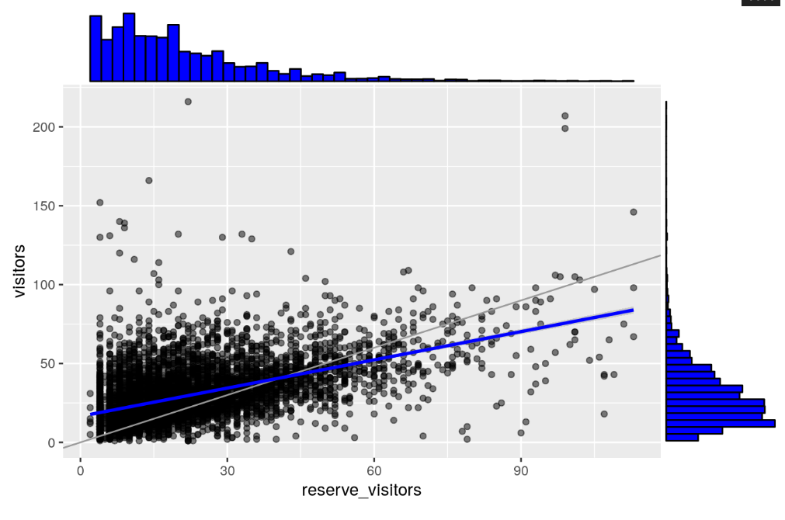

Take-away :

* The histograms show that the *reserve_visitors* and *visitors* numbers peak below ~20

* The scatter points fall largely above the line of identity, indicating that there were more *visitors* that day than had reserved a table.

* A notable fraction of the points is below the line, which probably indicates that some people made a reservation but changed their mind and didn’t go.**That kind of effect is probably to be expected and taking it into account will be one of the challenges in this competition.**

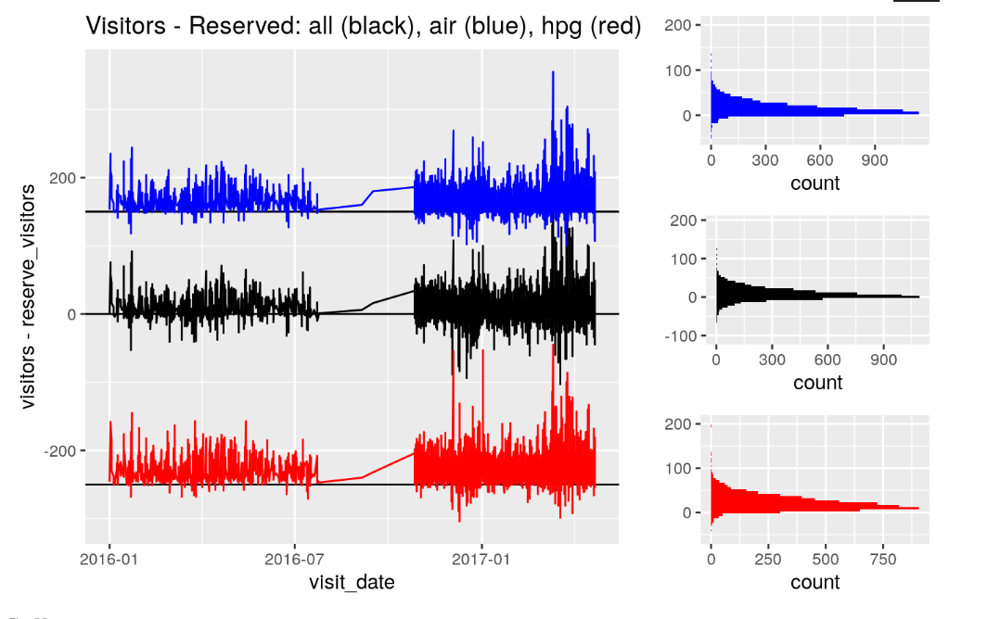

#### Take-away:

* The time series show significant scatter throughout the *training* time range. While the *air* (blue) and *hpg* (red) curves are predominantly above the baseline (i.e. more *visitors* than *reservations*), **combining the two data sets brings the mean of the distribution closer to the zero line. **This can also be seen in the corresponding histograms on the right side.

* The (flipped) histograms in the 3 right panels are roughly aligned with the time series in the left panel for convenience of interpretation. They demonstrate how much the distributions are skewed towards larger *visitor* numbers than *reserve_visitor* numbers. We might see a mix here between two distributions: a (probably normal) spread due to cancellations plus a tail from walk-in visitors, which should follow a **[Poisson distribution**.](https://towardsdatascience.com/the-poisson-distribution-103abfddc312)

# Feature engineering

The next step is to derive new features from the existing ones and the purpose of these new features is to provide additional predictive power for our goal to forecast *visitor* numbers. Those new features can be as simple as deriving the *day of the week* or the *month* from a *date* column; something that we have already used for our visual exploration. This section collects and studies these new features.

## Days of the week & months of the year:

We start simple, with the *week day (wday)* and *month* features derived from the *visit_date*. 

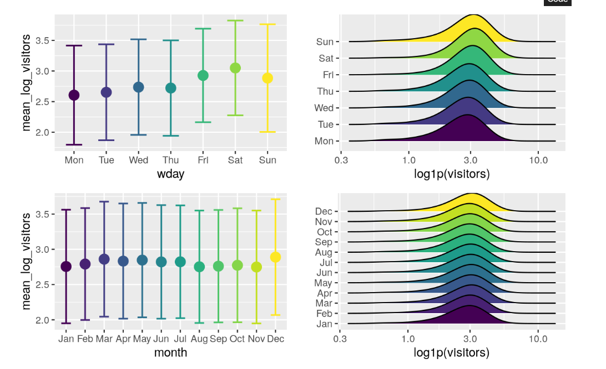

#### Take-away:

* The differences in mean log(visitor) numbers between the days of the week are much smaller than the corresponding uncertainties. This is confirmed by the density plots that show a strong overlap. Still, there is a trend toward higher visitor numbers on the weekend that might be useful.

##  Restaurant per area - air/hpg_count:

This feature will address the question of how many restaurant can be found in a certain area and whether larger numbers of restaurants per area affect the average *visitor* numbers.

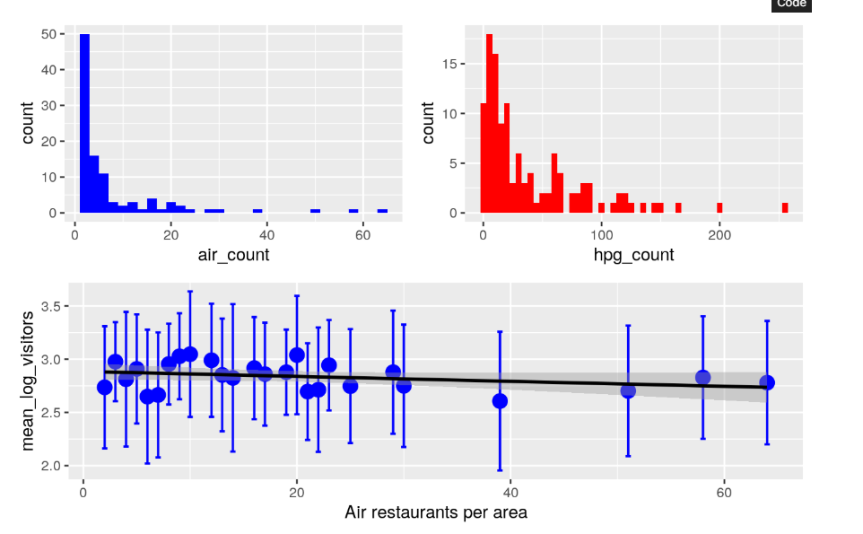

#### Take-away:

* Most areas in the *air* data set have only a few restaurants, with the distribution peaking at 2. There are always at least 2 of the same type. 

* The *hpg* data, with larger overall numbers, also peaks at low counts and has few other, smaller peaks through its decline.

* The mean log1p visitor numbers per area have large uncertainties and are all consistent with each other. There is a slight trend, shown by the black linear regression, toward lower average numbers for larger areas but it is quite weak.

## Distance from the busiest area:

## Whenever Kagglers have spatial coordinates in their data, they automatically also have the distances between these coordinates. As a first approximation we  use the linear distance between two points.

As the single reference point for all distances we choose the median latitude and median longitude. Our analysis can be extended to investigate all the pairwise distances between two restaurants within the same methodology.

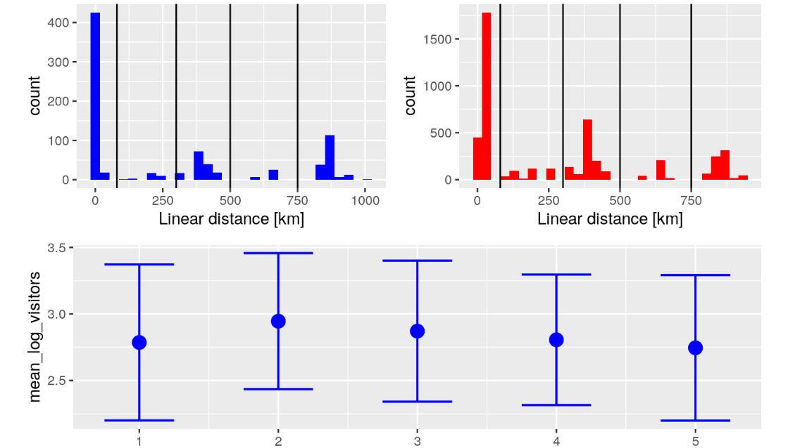

#### Take-away:

* The distance distribution has a clear peak at very short values; which is to be expected since our reference is the median. We also see further peaks, most prominently around ~450 km and ~800 km. These will correspond to (groups of) cities and are consistent between the *air* and *hpg* data. We define 5 distance bins based on the vertical black lines at 80, 300, 500, and 750 km.

* **The mean ****log1p****-transformed visitor counts for these 5 distance bins show no significant differences within their standard deviations.**

# First place solution: 

Winner use three same models with the same features:

* model_1(step=14): use 14 days for target and slip 30 times, so the winner have 14*30 samples.

* model_2(step=28): use 28 days for target and slip 15 times, so the winner have 28*15 samples.

* model_3(step=42): use 42 days for target and slip 10 times, so the winner have 42*10 samples.

*  The winners  also used ;

    * lightgbm as a boosting algorithm,

    * kfold  as a cross-validation method.

Features:

* 1.visit_info:(21,35,63,140,280,350,420) days before groupby：

 airstoreid,weekday,holiday,airareaname,airgenrename like:

(airstoreid,weekday),(airstoreid,holiday),(airareaname,airgenrename ,holiday) and so on.

* 2.reserve info:(35,63,140) days before groupby：

airstoreid,weekday,holiday,airareaname,airgenrename

* Ensemble:

Use (xgb,lgb,nn) 0.7lgb+0.2xgb+0.1*nn: only improved 0.0002 offline.

0.334model1+0.333model2+0.333*model_3:improved 0.002 offline.

# Highlights: 

1. The test data "intentionally spans a holiday week in Japan called the ‘Golden Week.’ 

2. The training set omits days where the restaurants were closed.

3. A weekend holiday has little impact on the visitor numbers, and even decreases them slightly, there is a much more pronounced effect for the weekdays; especially Monday and Tuesday (right panel). 

4. Relationship between restaurants per area and  visitor numbers.

5.  There were more *visitors* that day than had reserved a table.

6. some people made a reservation but changed their mind and didn’t go.That kind of effect is probably to be expected and taking it into account will be one of the challenges in this competition.

# Resources :

1. [https://www.kaggle.com/c/recruit-restaurant-visitor-forecasting/discussion/49129](https://www.kaggle.com/c/recruit-restaurant-visitor-forecasting/discussion/49129)

2. [https://www.kaggle.com/plantsgo/solution-public-0-471-private-0-505](https://www.kaggle.com/plantsgo/solution-public-0-471-private-0-505) (code)

3. [https://www.kaggle.com/c/recruit-restaurant-visitor-forecasting/notebooks](https://www.kaggle.com/c/recruit-restaurant-visitor-forecasting/notebooks)

4. [https://www.kaggle.com/captcalculator/a-very-extensive-recruit-exploratory-analysis](https://www.kaggle.com/captcalculator/a-very-extensive-recruit-exploratory-analysis)

